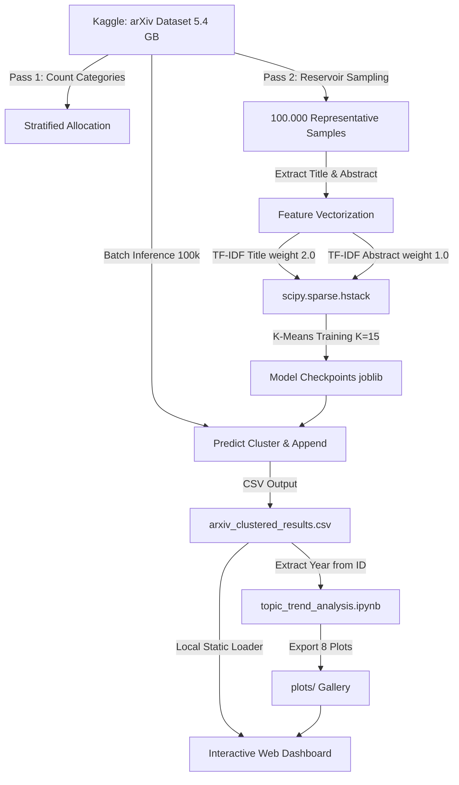

# 🌌 arXiv Topic Explorer & Clustering Dashboard

[](https://www.python.org/)
[](https://scikit-learn.org/)
[](https://www.kaggle.com/datasets/Cornell-University/arxiv)
[](https://opensource.org/licenses/MIT)

**arXiv Topic Explorer** adalah proyek sains data _end-to-end_ yang melakukan pengelompokan (_clustering_) topik, analisis tren popularitas temporal, dan visualisasi interaktif dari **3,1 juta+** metadata publikasi ilmiah di arXiv dari tahun 1993 hingga 2026.

---

## 📌 Daftar Isi

- [Overview Arsitektur](#-overview-arsitektur)
- [Struktur Folder](#-struktur-folder)
- [Daftar 15 Klaster Akademis](#-daftar-15-klaster-akademis)
- [Panduan Instalasi & Setup](#-panduan-instalasi--setup)
- [Alur Eksekusi Notebook](#-alur-eksekusi-notebook)
- [Panduan Menjalankan Web Dashboard](#-panduan-menjalankan-web-dashboard)
- [Desain Visual (Glassmorphism)](#-desain-visual-glassmorphism)
- [Lisensi](#-lisensi)

---

## 🏗️ Overview Arsitektur

Proyek ini dirancang menggunakan pipeline data hemat RAM $O(1)$ untuk memproses dataset berukuran 5.4 GB secara bertahap tanpa membebani memori sistem. Alur kerjanya digambarkan oleh diagram Mermaid berikut:



---

## 📂 Struktur Folder

```text
arXiv-Topic-Explorer/ (Root)
│
├── arxiv-metadata-oai-snapshot.json  <-- Berkas Dataset Utama (Unduh dari Kaggle)
├── README.md                         <-- Berkas Dokumentasi Repositori ini
│
├── 01_Clustering_and_Labelling/
│   ├── arxiv_topic_clustering.ipynb   <-- Latih K-Means & Prediksi 3.1M paper
│   ├── checkpoints/                  <-- Model KMeans & TF-IDF (.joblib)
│   ├── arxiv_clustered_results.csv   <-- Hasil prediksi klaster (CSV)
│   └── cluster_names.json             <-- Pemetaan 15 Klaster ke nama topik resmi
│
├── 02_Trend_Analysis/
│   ├── topic_trend_analysis.ipynb     <-- Analisis tren temporal (1993 - 2026)
│   └── plots/                        <-- 8 Grafik tren tahunan (PNG)
│
└── 03_Web_Dashboard/
    ├── index.html                    <-- Dashboard Utama (Glassmorphism)
    ├── style.css                     <-- Desain visual Apple HIG
    ├── app.js                        <-- Logika interaktif & Alat Prediktor
    └── data/
        └── cluster_names.json        <-- Salinan pemetaan untuk dashboard
```

---

## 🔬 Daftar 15 Klaster Akademis

Berikut adalah hasil klasifikasi topik sains data berdasarkan model K-Means terbobot:

| ID     | Nama Bidang Akademis Resmi                  | Top 3 Kategori arXiv Dominan                          |
| ------ | ------------------------------------------- | ----------------------------------------------------- |
| **00** | Gravitasi, Kosmologi & Fisika Energi Tinggi | gr-qc, hep-th, astro-ph.HE                            |
| **01** | Pemrosesan Bahasa Alami & AI Core           | cs.CL, cs.AI, cs.LG                                   |
| **02** | Sistem Kontrol, Optimasi & Sistem Dinamis   | cs.LG, cs.CV, cs.AI                                   |
| **03** | Fisika Kuantum & Informasi Kuantum          | quant-ph, cond-mat.mes-hall, hep-th                   |
| **04** | Fisika Energi Tinggi Teoretis               | hep-th, hep-ph, gr-qc                                 |
| **05** | Fisika Fenomenologi & Sistem Kompleks       | hep-ph, cs.LG, cs.AI                                  |
| **06** | Fisika Benda Terkondensasi & Ilmu Bahan     | cond-mat.mes-hall, cond-mat.str-el, cond-mat.mtrl-sci |
| **07** | Pembelajaran Mesin & Deep Learning Utama    | cs.LG, cs.AI, cs.CV                                   |
| **08** | Astrofisika & Astronomi                     | astro-ph.GA, astro-ph, astro-ph.SR                    |
| **09** | Visi Komputer & Jaringan Saraf              | cs.LG, cs.CV, cs.AI                                   |
| **10** | Topik Multidisiplin & Umum                  | hep-ph, cs.LG, cs.CV                                  |
| **11** | Aljabar, Teori Grup & Teori Representasi    | math.GR, math.RT, math.RA                             |
| **12** | Persamaan Diferensial & Analisis Numerik    | math.AP, math-ph, math.MP                             |
| **13** | AI Generatif, Difusi & Retrieval            | cs.CV, cs.AI, cs.CL                                   |
| **14** | Kosmologi & Fenomenologi Partikel           | hep-ph, astro-ph.CO, gr-qc                            |

---

## ⚙️ Panduan Instalasi & Setup

1. **Clone repositori ini**:

   ```bash
   git clone https://github.com/haidarfaizul/Arxiv-Topic-Explorer.git
   cd Arxiv-Topic-Explorer
   ```

2. **Instal dependensi Python**:

   ```bash
   pip install pandas numpy scipy scikit-learn joblib matplotlib seaborn jupyter
   ```

3. **Unduh Dataset**: Unduh [Kaggle Cornell University arXiv Dataset](https://www.kaggle.com/datasets/Cornell-University/arxiv) dan letakkan file `arxiv-metadata-oai-snapshot.json` di root direktori proyek Anda.

---

## 📓 Alur Eksekusi Notebook

1. **Latih & Prediksi**: Jalankan Jupyter Notebook di [01_Clustering_and_Labelling/arxiv_topic_clustering.ipynb](./01_Clustering_and_Labelling/arxiv_topic_clustering.ipynb). Notebook ini melatih model clustering pada 100k sampel representatif dan memprediksi klaster seluruh data sisa (~3.1M paper) menggunakan batch processing hemat memori.
2. **Analisis Tren**: Jalankan Jupyter Notebook di [02_Trend_Analysis/topic_trend_analysis.ipynb](./02_Trend_Analysis/topic_trend_analysis.ipynb) untuk menghasilkan 8 grafik visualisasi evolusi sains tahunan di folder [02_Trend_Analysis/plots/](./02_Trend_Analysis/plots/).

---

## 🖥️ Panduan Menjalankan Web Dashboard

1. Masuk ke folder [03_Web_Dashboard/](./03_Web_Dashboard/).
2. Klik ganda pada berkas [index.html](./03_Web_Dashboard/index.html) untuk langsung membukanya di browser internet Anda.
3. **Tab yang Tersedia**:
   - **Overview**: Widget informasi ringkas statistik dataset.
   - **Topic Explorer**: Sidebar interaktif untuk melihat deskripsi, kata kunci teratas, dan kategori arXiv asli dari 15 klaster topik.
   - **Trend Analysis**: Galeri visualisasi 8 grafik tren temporal.
   - **Interactive Predictor**: Masukkan judul/abstrak draf paper baru Anda untuk diprediksi klasternya secara instan langsung di sisi klien (_client-side_).
